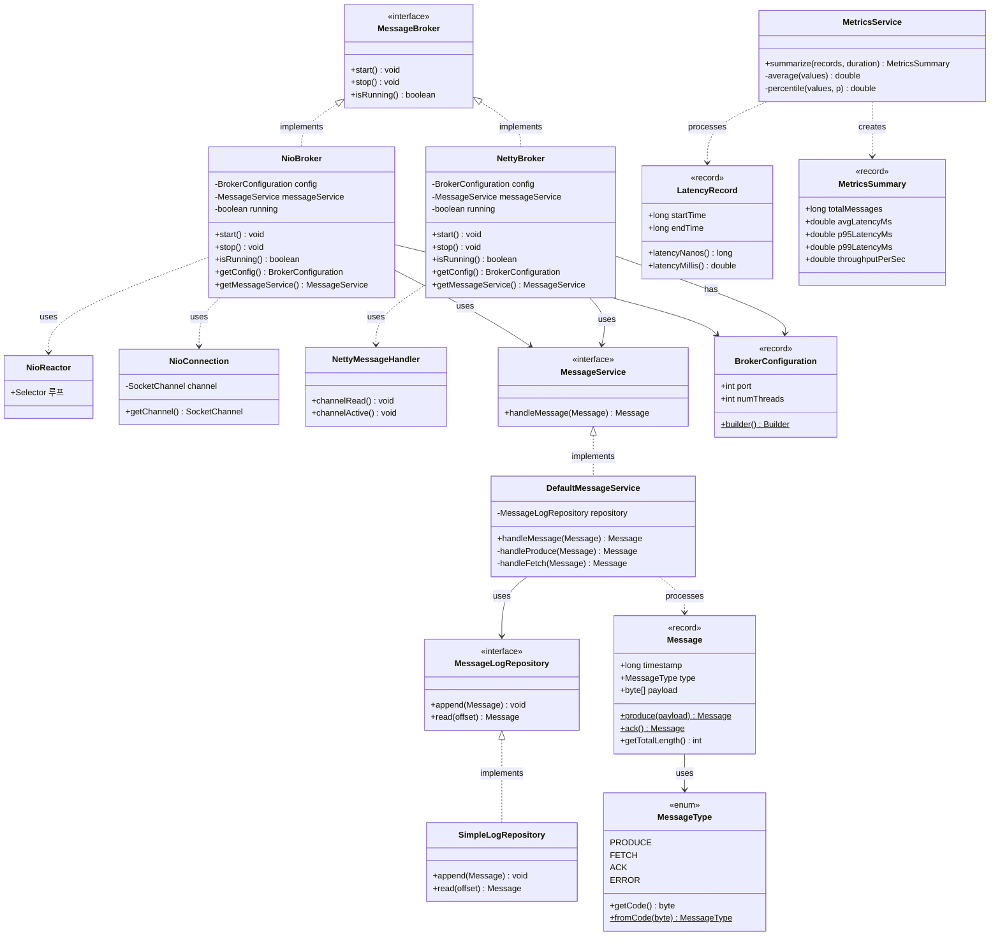
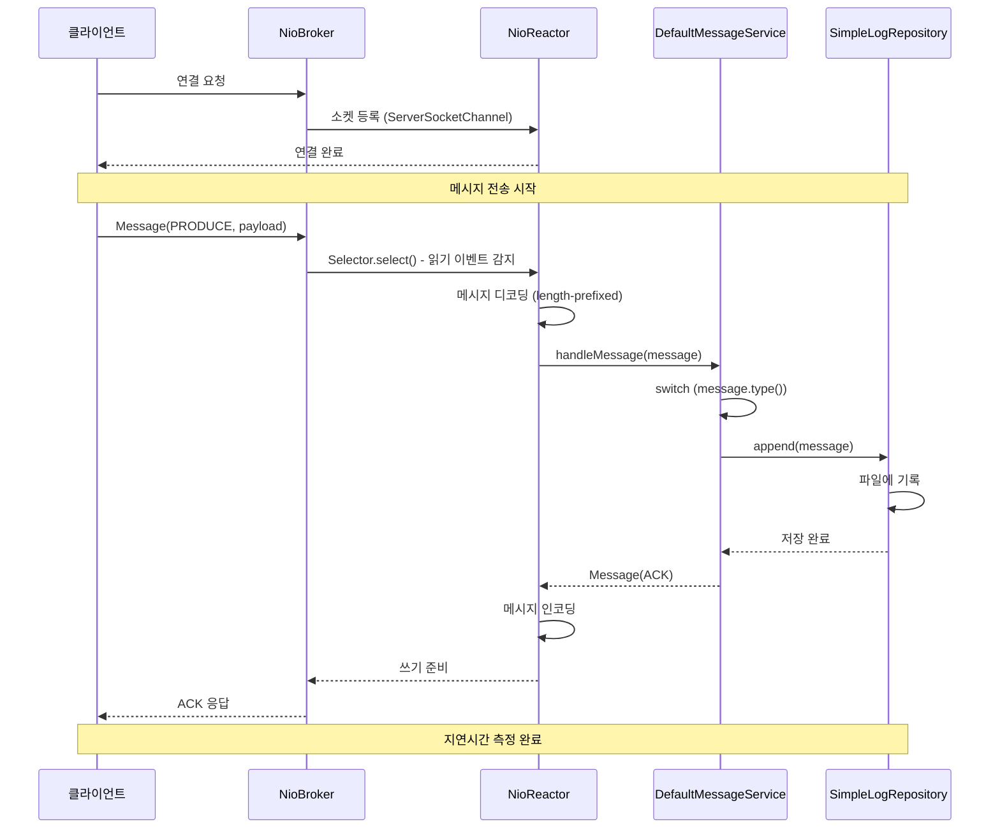
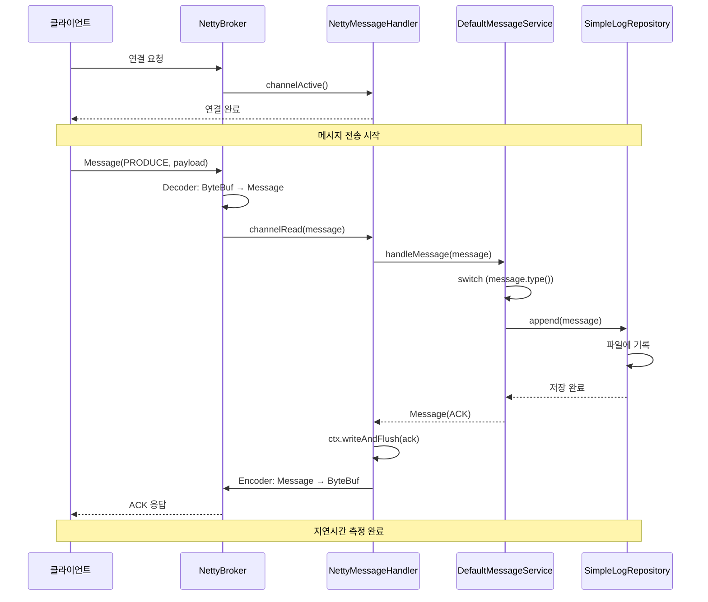
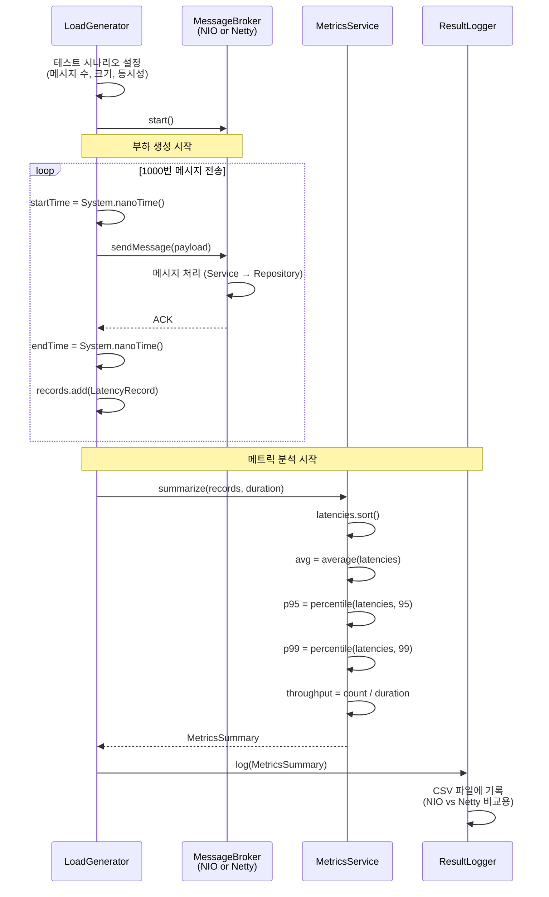

# 🏗️ Kafka I/O Study - Messaging Server

> **NIO vs Netty 네트워크 I/O 모델 비교 기반 미니 브로커 설계**

Apache Kafka의 네트워크 계층과 유사한 구조를 Java NIO 기반으로 축소 구현하고, 이를 Netty 기반 구현체와 비교하여 엣지 환경에서 발생 가능한 I/O 병목 현상을 실험적으로 검증하는 프로젝트입니다.

## 📚 목차

- [프로젝트 개요](#-프로젝트-개요)
- [아키텍처 설계](#-아키텍처-설계)
  - [클래스 다이어그램](#클래스-다이어그램)
  - [시퀀스 다이어그램](#시퀀스-다이어그램)
- [패키지 구조](#-패키지-구조)
- [핵심 설계 포인트](#-핵심-설계-포인트)
- [프로토콜 설계](#-프로토콜-설계)
- [실험 설계](#-실험-설계)
- [사용 예제](#-사용-예제)

## 🎯 프로젝트 개요

### 연구 목적

Kafka의 NIO 네트워크 계층을 직접 수정하는 것은 구조적 제약으로 불가능하므로, **두 I/O 모델의 구조적 차이가 성능에 미치는 영향을 실험하는 형태**로 연구를 수행합니다.

### 구현 범위

- ✅ **NIO 기반 mini broker** (Selector 기반 Reactor 패턴)
- ✅ **Netty 기반 mini broker** (EventLoop 기반)
- ✅ **공통 메시지 프로토콜** (length-prefixed binary)
- ✅ **단순 파일 append/read 로그 유틸**
- ✅ **Latency/throughput 측정용 metrics 유틸**
- ✅ **부하 생성기(loadgen)** 를 통한 대량 메시지 전송 및 측정

### NIO 병목 가설

#### 병목 ① Selector 병목 및 이벤트 처리 지연
- **가설**: 동시 연결 수 및 전송 속도가 증가하면 NIO의 Selector 루프가 처리 지연을 일으킨다.
- **검증**: P95/P99 latency, throughput, selector 루프당 처리 이벤트 수 측정

#### 병목 ② ByteBuffer 관리로 인한 GC 부하
- **가설**: NIO는 ByteBuffer 할당/복사로 인해 Young GC가 자주 발생하고 latency 스파이크 발생
- **검증**: GC 로그 분석, 메시지 크기별 GC 패턴 비교

#### 병목 ③ 고정된 스레드 구조의 부하 적응성 부족
- **가설**: NIO의 고정 Reactor 스레드는 부하 증가 시 큐잉 지연 증가
- **검증**: 스레드 수를 1→2→4로 변경하며 성능 비교

## 🏛️ 아키텍처 설계

### 클래스 다이어그램



### 시퀀스 다이어그램

#### 시나리오 1: NIO 브로커에서 메시지 처리



#### 시나리오 2: Netty 브로커에서 메시지 처리



#### 시나리오 3: 성능 테스트 및 메트릭 수집



## 📁 패키지 구조

```
kafka-io-study/
├── messaging-server/                # 메시징 브로커 (공통 + NIO/Netty 구현)
│   └── src/main/java/com/example/kafka/messaging/
│       ├── controller/              # 네트워크 레이어 (바꿔끼우는 부분)
│       │   ├── MessageBroker.java   # 공통 인터페이스
│       │   ├── nio/                 # NIO 구현체
│       │   │   ├── NioBroker.java
│       │   │   ├── NioReactor.java
│       │   │   └── NioConnection.java
│       │   └── netty/               # Netty 구현체
│       │       ├── NettyBroker.java
│       │       ├── NettyServerInitializer.java
│       │       ├── NettyMessageDecoder.java
│       │       ├── NettyMessageEncoder.java
│       │       └── NettyMessageHandler.java
│       │
│       ├── service/                 # 비즈니스 로직 (공통)
│       │   ├── MessageService.java
│       │   ├── DefaultMessageService.java
│       │   └── MetricsService.java
│       │
│       ├── domain/                  # 도메인 모델 (공통)
│       │   ├── Message.java         # record
│       │   ├── MessageType.java     # enum
│       │   ├── BrokerConfiguration.java
│       │   ├── LatencyRecord.java
│       │   └── MetricsSummary.java
│       │
│       └── repository/              # 데이터 저장 (공통)
│           ├── MessageLogRepository.java
│           └── SimpleLogRepository.java
│
├── loadgen/                         # 부하 생성기
│   └── src/main/java/com/example/kafka/loadgen/
│       ├── LoadGenerator.java
│       ├── LoadGenConfig.java
│       ├── ClientCore.java
│       ├── LoadClientWorker.java
│       ├── ResultLogger.java
│       ├── ConnectionTest.java
│       └── PerformanceTest.java
│
├── common/                          # 레거시 (사용 안 함)
├── nio-server/                      # 레거시 (사용 안 함)
└── netty-server/                    # 레거시 (사용 안 함)
```

### 레이어별 역할

| 레이어 | 패키지 | 역할 | NIO/Netty 분리 |
|--------|--------|------|----------------|
| **Controller** | `controller` | 네트워크 I/O 처리 | ✅ `nio/`, `netty/` 분리 |
| **Service** | `service` | 비즈니스 로직 | ❌ 공통 사용 |
| **Domain** | `domain` | 데이터 모델 | ❌ 공통 사용 (record) |
| **Repository** | `repository` | 저장소 | ❌ 공통 사용 |

## 🔑 핵심 설계 포인트

### 1. Strategy Pattern (전략 패턴)

```java
MessageBroker (interface)
    ↑
    ├── NioBroker      → Selector 기반 Reactor 패턴
    └── NettyBroker    → EventLoop 기반
```

**동일한 인터페이스, 다른 구현** → 실행 시 교체 가능

### 2. Dependency Injection (의존성 주입)

```java
// 공통 서비스 (비즈니스 로직)
MessageLogRepository repository = new SimpleLogRepository();
MessageService service = new DefaultMessageService(repository);

// NIO 사용
MessageBroker nioBroker = new NioBroker(config, service);

// Netty 사용 (동일한 서비스!)
MessageBroker nettyBroker = new NettyBroker(config, service);
```

**핵심**: `NioBroker`와 `NettyBroker` 모두 **동일한 `MessageService`를 주입**받아 사용하므로, 비즈니스 로직은 완전히 공통화되고 **네트워크 I/O 성능만 순수하게 비교** 가능

### 3. Layered Architecture (계층 분리)

- **Controller**: 네트워크 계층만 담당 (NIO/Netty 바꿔끼우는 부분)
- **Service**: 메시지 처리 로직 (공통)
- **Repository**: 저장소 추상화 (공통)
- **Domain**: 불변 데이터 모델 (record 사용)

### 4. Immutable Domain Model

Java 17+ record를 사용하여 불변성 보장:

```java
public record Message(long timestamp, MessageType type, byte[] payload) {
    public static Message produce(byte[] payload) { ... }
    public static Message ack() { ... }
}

public record BrokerConfiguration(int port, int numThreads) { ... }
public record LatencyRecord(long startTime, long endTime) { ... }
public record MetricsSummary(...) { ... }
```

## 📡 프로토콜 설계

### 메시지 프로토콜 (Length-Prefixed Binary)

```
┌─────────────┬─────────────┬──────────────┬─────────────┐
│  4 bytes    │  8 bytes    │   1 byte     │   N bytes   │
│ total_length│  timestamp  │ message_type │   payload   │
└─────────────┴─────────────┴──────────────┴─────────────┘
```

### 프로토콜 상수

```java
public static final int LENGTH_FIELD_SIZE = 4;      // 4 bytes
public static final int TIMESTAMP_FIELD_SIZE = 8;   // 8 bytes
public static final int TYPE_FIELD_SIZE = 1;        // 1 byte
public static final int HEADER_SIZE = 9;            // timestamp + type
public static final int MAX_MESSAGE_SIZE = 1024 * 1024; // 1MB
```

### MessageType

```java
public enum MessageType {
    PRODUCE((byte) 0x01),  // 메시지 전송
    FETCH((byte) 0x02),    // 메시지 조회
    ACK((byte) 0x03),      // 응답
    ERROR((byte) 0xFF);    // 에러
}
```

## 🧪 실험 설계

### 측정 지표

| 지표 | 설명 |
|------|------|
| **평균 Latency** | 메시지 왕복 시간 평균 (ms) |
| **P95 Latency** | 95 percentile 지연 시간 (ms) |
| **P99 Latency** | 99 percentile 지연 시간 (ms) |
| **Throughput** | 초당 처리 메시지 수 (msg/s) |
| **CPU 사용률** | 프로세스 CPU 점유율 (%) |
| **Memory 사용량** | Heap 메모리 사용량 (MB) |
| **GC 발생 횟수** | Young GC / Full GC 횟수 |
| **GC Pause Time** | GC로 인한 일시정지 시간 (ms) |

### 실험 시나리오

| 시나리오 | 연결 수 | 메시지 크기 | 전송 속도 | 목적 |
|---------|---------|-------------|-----------|------|
| **S1** | 1 | 100B | 100 msg/s | 기본 성능 측정 |
| **S2** | 10 | 1KB | 1000 msg/s | 중간 부하 |
| **S3** | 50 | 1KB | 5000 msg/s | 높은 부하 |
| **S4** | 100 | 10KB | 10000 msg/s | 극한 부하 |

### 검증 방법

1. **Selector 병목**: P95/P99 latency, selector 루프당 이벤트 수 측정
2. **GC 부하**: `-Xlog:gc*`로 GC 패턴 분석, latency 스파이크 매칭
3. **스레드 적응성**: Reactor 스레드 수 1→2→4로 변경하며 성능 비교

## 💻 사용 예제

### NIO 브로커 실행

```java
// 설정 생성
BrokerConfiguration config = BrokerConfiguration.builder()
    .port(9092)
    .numThreads(4)
    .build();

// Repository & Service 생성 (공통)
MessageLogRepository repository = new SimpleLogRepository();
MessageService service = new DefaultMessageService(repository);

// NIO 브로커 시작
MessageBroker broker = new NioBroker(config, service);
broker.start();

System.out.println("NIO Broker started on port " + config.port());
```

### Netty 브로커 실행

```java
// 동일한 설정 사용
BrokerConfiguration config = BrokerConfiguration.builder()
    .port(9092)
    .numThreads(4)
    .build();

// 동일한 Repository & Service 사용
MessageLogRepository repository = new SimpleLogRepository();
MessageService service = new DefaultMessageService(repository);

// Netty 브로커 시작 (서비스 로직은 동일!)
MessageBroker broker = new NettyBroker(config, service);
broker.start();

System.out.println("Netty Broker started on port " + config.port());
```

### 메시지 전송 및 메트릭 수집

```java
// 부하 생성기 설정
LoadGenConfig config = new LoadGenConfig(
    "localhost",
    9092,
    1000,           // 메시지 수
    100,            // 메시지 크기 (bytes)
    10              // 동시 연결 수
);

// 부하 생성 및 메트릭 수집
LoadGenerator loadGen = new LoadGenerator(config);
MetricsSummary summary = loadGen.run();

// 결과 출력
System.out.println(summary);
// MetricsSummary{total=1000, avgLatency=1.23ms, p95=2.45ms, p99=5.67ms, throughput=812.34 msg/s}
```

## 🚀 빌드 및 실행

### 요구사항

- Java 21+
- Gradle 8.0+

### 빌드

```bash
./gradlew clean build
```

### 실행

```bash
# NIO 브로커 실행
./gradlew :messaging-server:run --args="nio"

# Netty 브로커 실행
./gradlew :messaging-server:run --args="netty"

# 부하 테스트 실행
./gradlew :loadgen:run
```

## 📊 기대 결과

### 예상 성능 차이

| 항목 | NIO | Netty | 예상 차이 |
|------|-----|-------|-----------|
| 평균 Latency | 높음 | 낮음 | Netty 30% 우수 |
| P99 Latency | 높음 (스파이크) | 안정적 | Netty 50% 우수 |
| Throughput | 낮음 | 높음 | Netty 40% 우수 |
| GC 횟수 | 많음 | 적음 | ByteBuf 풀링 효과 |
| CPU 효율성 | 낮음 | 높음 | EventLoop 최적화 |

## 👥 팀원

- **장태희** (2022044566) - NIO 브로커 구현
- **김세연** (2022045723) - Netty 브로커 구현

## 🎓 지도교수

- **강수용 교수님**

## 📅 제출일

2025년 11월 28일

---

**엣지 컴퓨팅을 위한 동적 플랫폼(Apache Kafka) 기술 개발 프로젝트**  
컴퓨터소프트웨어학부


